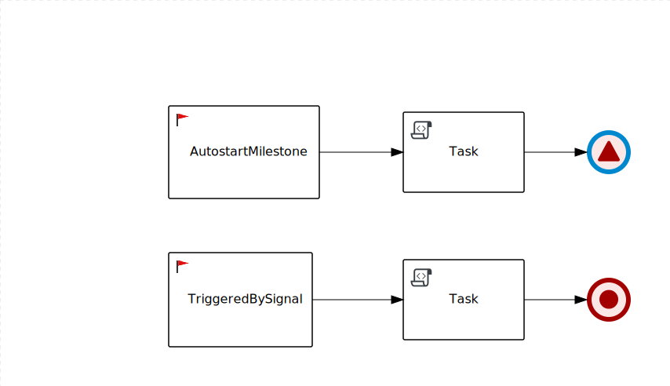

Non string parameters for Service Task' methods
-----------------------------------------------

## Requirements
* Java 11+
* Configured $JAVA_HOME environment variable
* Maven 3.6.2+

## Process



## Process settings
```
Autostart=true
ProcessType=Public
Executable=True
```

## To run this example

```
mvn clean compile quarkus:dev
```

In another terminal window execute:
```
curl -X POST "http://localhost:8080/SimpleMilestone" -H  "accept: application/json" -H  "Content-Type: application/json" -d "{}"
```

## Output
Now you will see two messages in the console log:
```
AutostartMilestone started!
TriggeredBySignal Milestone started!
```

First AutostartMilestone will be started together with the process due to Autostart=true property.

The second message will be printed after the second TriggeredBySignal Milestone triggered. It triggered by the Signal End.
