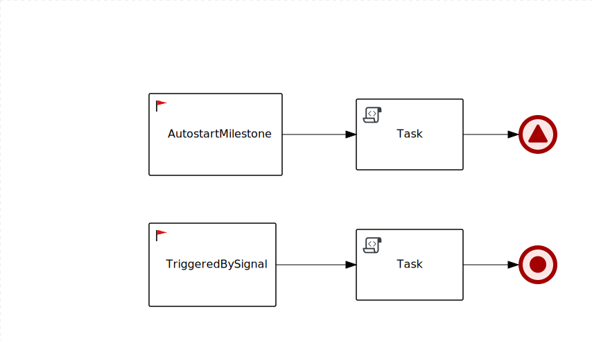

Non string parameters for Service Task' methods
-----------------------------------------------

Requirements:
* Java 11+
* Configured $JAVA_HOME environment variable
* Maven 3.6.2+



To run this example:

```
mvn clean compile quarkus:dev
```

In another terminal window execute:
```
curl -X POST "http://localhost:8080/SimpleMilestone" -H  "accept: application/json" -H  "Content-Type: application/json" -d "{}"
```
